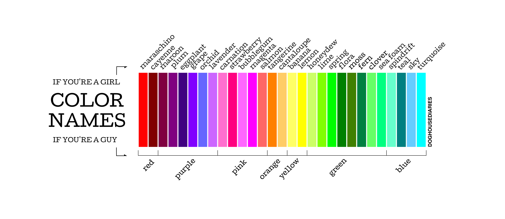

# My Notes - A Journal of Discovery

> Your first learning adventure should begin with [**Mastering Markdown**](https://guides.github.com/features/mastering-markdown/). Learning how to use Markdown now will really help you focus on capturing **content** in this journal. :sunglasses:

## Table of Contents

> *There are **three** things you must always be expanding your knowlege of:*
>
> - Know the **problem** you are trying to solve
> - Know your **language** (i.e.: JavaScript)
> - Know your **tools**

- [**JavaScript in the Browser**](./01-JS-in-the-browser.md)

----

[http://www.thedoghousediaries.com/1406](http://www.thedoghousediaries.com/1406)

----

<!-- Custom Styling - Modify for Fun and Learning - No Warranties Implied -->

----

## Credits

> Scuba Image licensed to *Dan Gilleland* through Presenter Media - Used for educational purposes (*'cause it creates interest*). If you wish to re-use this in your own projects, please purchase your own [License](https://www.presentermedia.com/eula.html) through [**Presenter Media**](https://www.presentermedia.com/).
