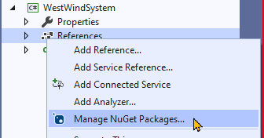

# Getting Started with Web Forms

## Creating a Client-Server Web Forms Solution

1. Begin with a new ASP.NET Web Application

    

1. Add a Class Library to the solution

    

1. Add a project reference in the Web Forms Application project to link to the Class Library project

    

    

1. Add NuGet Package(s) to the Class Library (in this case, EntityFramework)

    

    

1. Add NuGet Package(s) to the Web App (Entity Framework)

    

    
    
1. Update NuGet Packages

    

    

----

## A First-Look at Web Forms

In the Web Forms template for ASP.NET Web Applications, you are presented with a different set of files than what you see in the Empty template. Here, you see *Master Pages* (`.master` files) for layout and *ASPX Pages* (`.aspx`, `.aspx.cs` and `.aspx.designer.cs` files) for page content files.

Because we updated the Bootstrap version from the one that the template's layout was expecting, we will need to update the `Site.master` page to match the following for the menu navigation and the main content.

## WestWind

The solution we've built here is based on **WestWind Wholesale** (like our earlier Razor examples). Rather than re-create the back-end code, we can copy over the files and include them in our project.

## Playing with Web Forms

In this introduction, we created a new web form page (with master).

Note that our content for our page needs to be placed inside the `<asp:Content>` Server Control.

When we add Server Controls to our Web Form, Visual Studio will generate code (placed inside the `.aspx.designer.cs`) that "maps" properties onto our Code-Behind class which will correspond to the Server Controls in our aspx page.

Buttons can have their "click" event mapped to a method on our Code-Behind class to process the user's click.

## Summary

Web Forms is different from the Razor forms that we used earlier. There are some benefits to Web Forms over these earlier-version Razor forms.

> **NOTE:** In *.NET Core*, Web Forms no longer exist. In their place, **Razor Pages** have been introduced that bring the best of the old-style *Razor forms* and *Web Forms* together.
