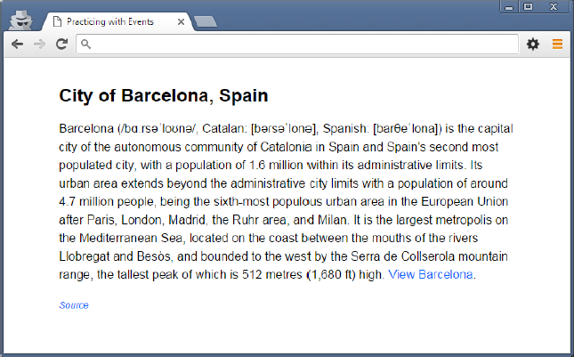
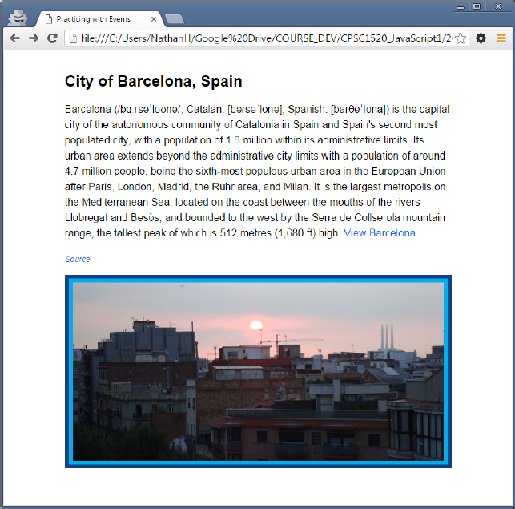

# Working with Events

## JavaScript Events

> To follow along with this exercise, you will need to open the [practice/index.html](./practice/index.html) in your browser with Live-Server.

Much of what has made JavaScript so popular has to do with how simple it is to listen for events in the browser. Tracking and acting on user interaction with the browser is what makes a web page interactive and allows us to create a variety of meaningful experiences for the user. That being said, there are essentially three steps to remember when implementing event listeners:

1. Identify what element(s) you want to listen to for event triggers
2. Create a function that performs the desired action for when the event occurs
3. Add the function as an event listener for the desired event to the element(s) in question

If you can remember these three general steps, you will be well on your way to implementing event listeners. Let's walk through an example.

### Image Description Display

We will implement some very basic interaction together that relies on a link to display an image. The trick is that clicking the link should not trigger the browser to load the image file directly in the browser, which is the default behaviour when clicking 'a' elements that have an href attribute. Instead, we want to have the image display on the same page in the img.feature element. The screenshot below displays the main interface.

> Figure 1. Starting project output



The tasks we need to take care of are the following:

1. Identify the feature link that will control the display of the image
2. Create a function to link the href attribute of the feature link and the src attribute of the feature img element
3. Add the function we created in step 2 as an event listener to the feature link

#### Step 1: Select the link

Create and link a JavaScript file to the index.html page. Once done, you can write your scripts in this file and have them execute in the browser.

Now, to select the desired element, you will need to study the html in order to find out how to best query for the element. Create a variable named featureLink for the feature link element and select the element into this variable (this is left for you to do on your own … you know how).

#### Step 2: Create the event listener function

Once you have selected the feature link into a variable, it is time to create the event listener function (often also referred to as an event handler). What's important is to first determine what exactly should happen when the link is clicked. The following steps layout what we would like to happen:

1. Once clicked, the href value must be retrieved from the link
2. The href value must be used as the src attribute value for the feature image
3. Now that the src has been set, the feature image needs to be displayed
    - This requires the removal of the hidden class

So now we can create a function that carries out this task.

> Example 1. Feature link event listener function

```js
const featureLinkHandler = function (evt) {
  let featureImage = document.querySelector('img.feature');
  featureImage.src = evt.target.href;
  featureImage.classList.remove('hidden');
}
```

#### Step 3: Add the function as an event listener

This is usually the simplest part of the operation. To add an event listener, we simply call the `addEventListener` function on the desired element (in this case the feature link). This function accepts two parameters:

1. The event to listen for as a string
2. The event listener function to call

> 3. Example 2. Adding the event listener for the feature link

```js
featureLink.addEventListener('click', featureLinkHandler);
```

The important thing to note from the example is that the featureLinkHandler is not called at this time. The function is simply passed as a variable, as it is intended to be called at some future point when the link is actually clicked.

##### Testing: It's broken!?

You should now reload the web page and test your code. Remember to first look in the console for any errors you may have made (e.g. typos, syntax errors, etc.) and fix those first. Once you can load the page without any errors, click the link and … it doesn't work! Or more specifically, the `<a>` tag did its default behavour of navigating to another page.

What should happen at this time is that the image actually loads in the page, replacing our index.html page. Didn't we take all the necessary steps? Well yes and no. Our approach is good but we overlooked one thing: clicking hyperlinks is already handled by a default behaviour in the browser, and it's still being used. What we need to do is prevent this from happening.

#### Step 4: Preventing the default behaviour

In order to prevent the default behaviour, we need access to the actual event object that represents all the information we may need about what just happened. This object can be accessed as the first parameter in our function, so we need to provide a name for it in our function declaration:

> Example 3. Adding a parameter for the event object

```js
const featureLinkHandler = function (evt) {
  let featureImage = document.querySelector('img.feature');
  featureImage.src = evt.target.href;
  featureImage.classList.remove('hidden');
}
```

In the above example, you can see the change. The parameter name `evt` is used as a reference to the event object that will be passed to this function when it is actually called. Remember, we don't ever actually call this function in our code, the browser does when the link is clicked. It is at this time that the event object will be passed in.

Once you have access to the event object, you can call any number of available functions on the object or access a number of properties. The function we're interested in here is the `preventDefault` function. This function, when called on the event object, will do exactly what its name states: prevent the default behaviour from occurring.

> Example 4. Adding a parameter for the event object

```js
const featureLinkHandler = function (evt) {
  let featureImage = document.querySelector('img.feature');
  featureImage.src = evt.target.href;
  featureImage.classList.remove('hidden');
  evt.preventDefault();
}
```

Again, the highlighted statement in the previous example demonstrates how this can be done.

#### Step 6: It works!

Reload the page in the browser (again checking for errors first) and now click the feature link. You should be presented with a lovely picture of Barcelona at sunrise.

> Figure 2. The final result


